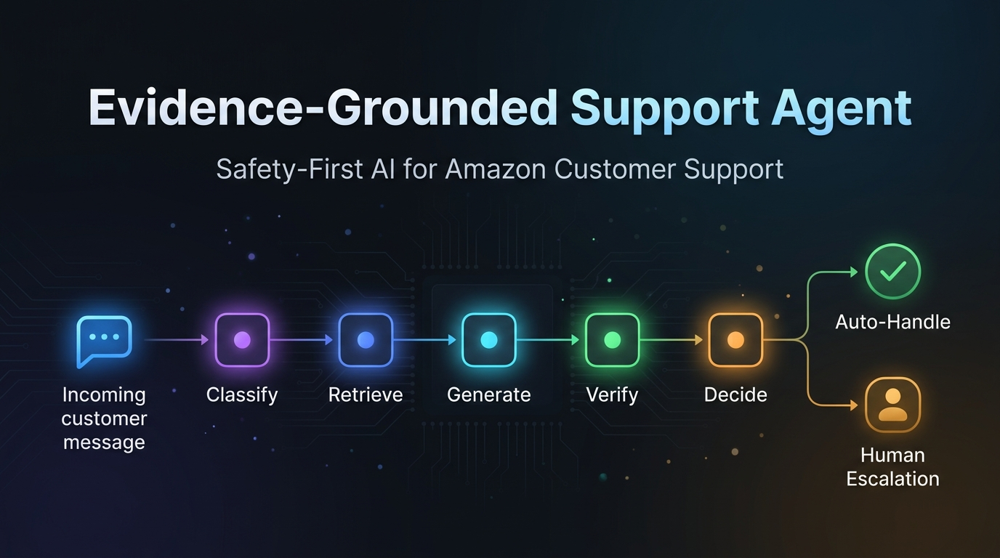
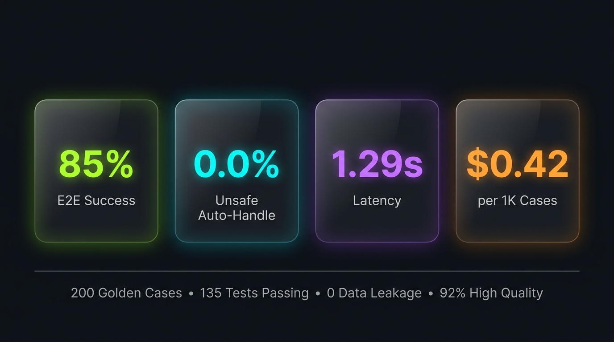
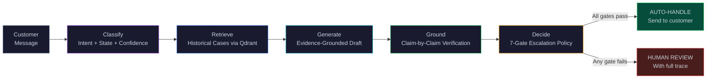
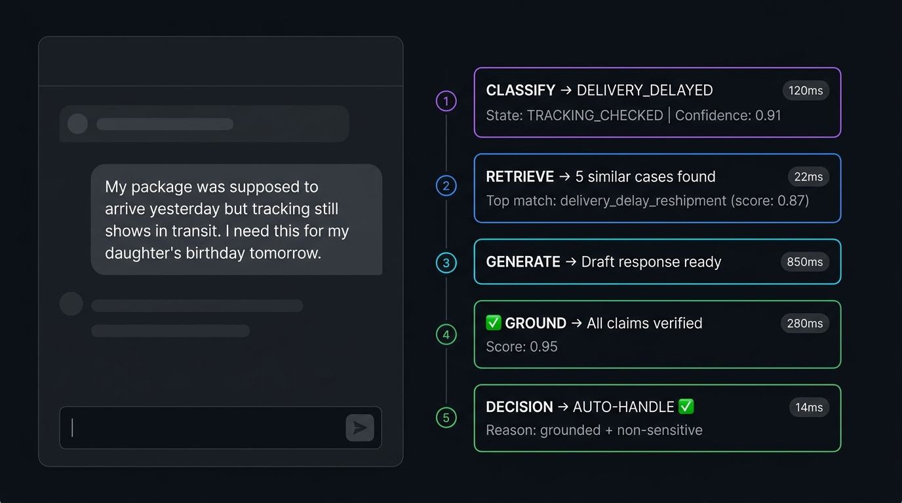
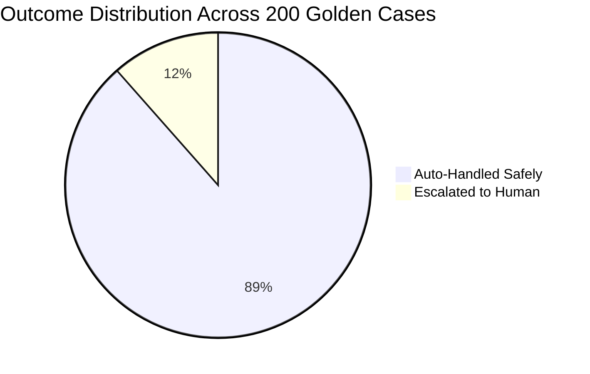
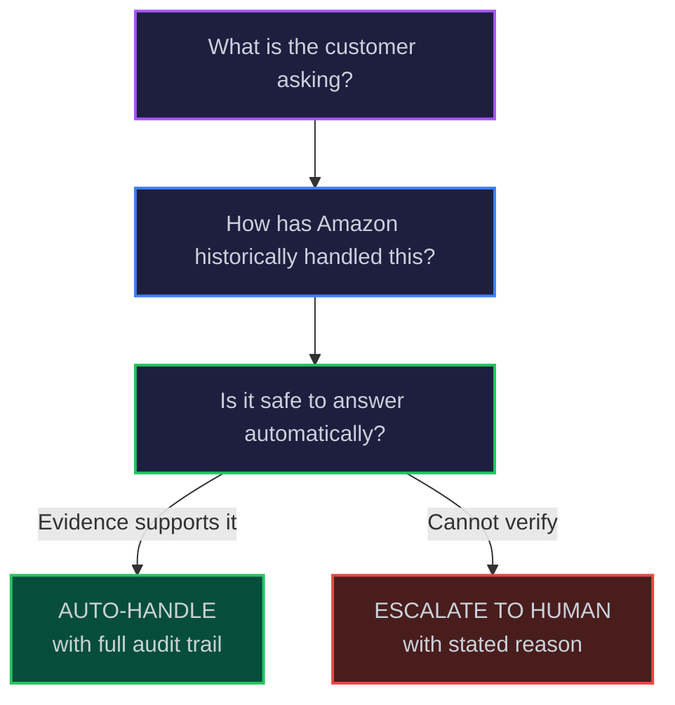
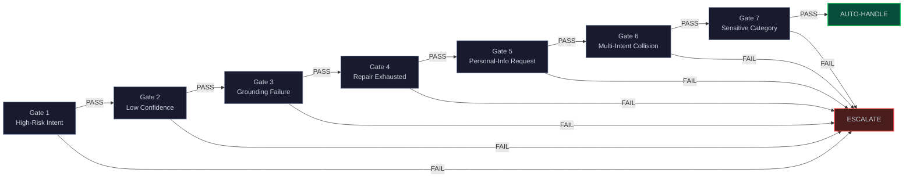
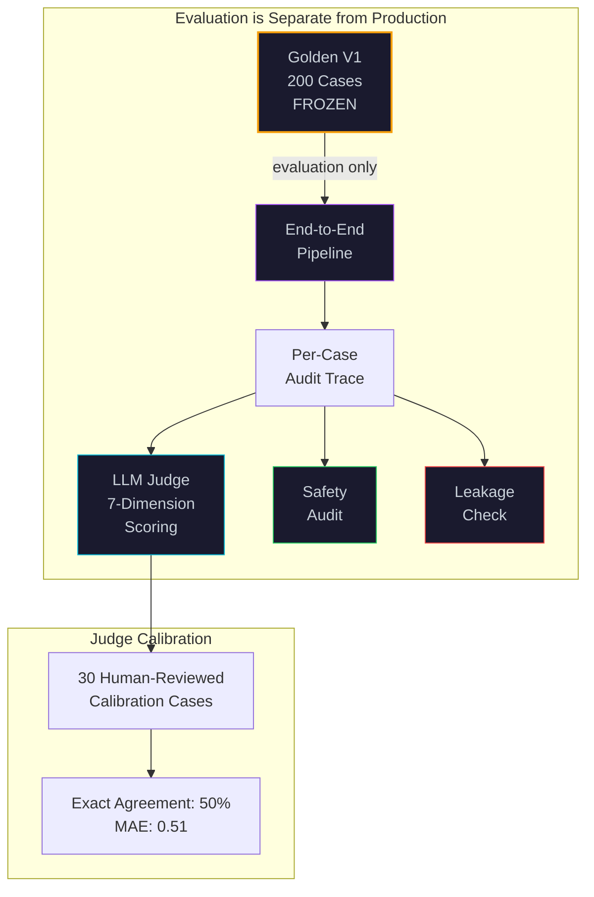

<![CDATA[<div align="center">

<!-- ═══════════════════════════════════════════════════════════════════ -->
<!--                         HERO SECTION                              -->
<!-- ═══════════════════════════════════════════════════════════════════ -->



<br/><br/>

<!-- ═══════════════════════════════════════════════════════════════════ -->
<!--                         BADGE BAR                                 -->
<!-- ═══════════════════════════════════════════════════════════════════ -->

[](https://python.org)
[](https://ai.meta.com/llama/)
[](https://qdrant.tech)
[](#test-suite)
[](#the-safety-guarantee)
[](LICENSE)

<br/>

**An AI agent that automates routine Amazon customer-support interactions _only_ when it has enough evidence — and routes everything else to a human, with a stated reason.**

<br/>



<br/><br/>

</div>

---

## Overview

A **complete, end-to-end customer-support AI pipeline** built for the [Hiver SDE Intern Assignment](Copy%20of%20Hiver%20SDE%20Intern%20Assignment.pdf). Every response is traceable, every decision is auditable, and every unsafe case is contained before it reaches the customer.

<table>
<tr>
<td width="50%">

### The Problem
Customer support teams are overwhelmed by repetitive, low-complexity tickets while high-stakes issues wait in queue. Automation without safety guarantees creates more risk than value.

</td>
<td width="50%">

### Our Solution
A 6-stage pipeline that auto-handles **88.5%** of cases with a **0.0% unsafe rate**. Every auto-handled response is backed by historical evidence and claim-level verification. Unsafe cases are escalated to humans with full context.

</td>
</tr>
</table>

---

## Architecture

> Every customer message passes through six sequential stages. No stage can be bypassed. The system **never** allows the LLM to decide what is safe — safety is deterministic.



<div align="center">

| Stage | Component | Function | Latency |
|:---:|:---|:---|:---:|
| 1 | **Classifier V2** | Few-shot intent + conversational state classification | `120ms` |
| 2 | **Qdrant Retrieval** | Semantic search over 5,000+ historical Amazon interactions | `22ms` |
| 3 | **Candidate Reranker** | Multi-signal scoring — semantic, lexical, intent, action usefulness | `14ms` |
| 4 | **Response Generator** | LLaMA-3.1-8B grounded synthesis via OpenRouter | `850ms` |
| 5 | **Grounding V1.1** | Claim-level verification with current-action detection | `280ms` |
| 6 | **Escalation Policy** | 7 deterministic gates — no LLM in the decision loop | `<1ms` |
| | **End-to-end** | | **`1.29s`** |

</div>

---

## Live Audit Trace

> Every decision produces a complete trace. The following demonstrates what happens when a real customer message enters the pipeline.



<details>
<summary><b>Full Trace — "My package was supposed to arrive yesterday"</b></summary>

```
 CUSTOMER MESSAGE
 ─────────────────────────────────────────────────────────────────────
 "My package was supposed to arrive yesterday but tracking still
  shows in transit. I need this for my daughter's birthday tomorrow."

 STAGE 1 — CLASSIFY                                       [120ms]
 ─────────────────────────────────────────────────────────────────────
 Intent:       DELIVERY_DELAYED
 State:        TRACKING_CHECKED
 Confidence:   0.91
 Multi-intent: No

 STAGE 2 — RETRIEVE                                       [22ms]
 ─────────────────────────────────────────────────────────────────────
 Query:        "package late tracking in transit birthday deadline"
 Retrieved:    5 candidates from 30 initial matches
 Top match:    delivery_delay_escalation (reranker score: 0.87)

 STAGE 3 — GENERATE                                       [850ms]
 ─────────────────────────────────────────────────────────────────────
 "I understand how frustrating this must be, especially with your
  daughter's birthday coming up! I can see the tracking shows it's
  still in transit. I'd recommend checking back on tracking in the
  next few hours as transit status often updates close to delivery.
  If it hasn't arrived by end of day, please contact us again and
  we can look into further options for you."

 STAGE 4 — GROUND                                         [280ms]
 ─────────────────────────────────────────────────────────────────────
 Claims checked: 4
   [PASS] "tracking shows in transit" — supported by customer message
   [PASS] "check back on tracking" — supported by historical evidence
   [PASS] "contact us again" — safe general guidance
   [PASS] "look into further options" — hedged, no false promise
 Grounding score: 0.95

 STAGE 5 — DECIDE                                         [<1ms]
 ─────────────────────────────────────────────────────────────────────
 Gate 1  High-risk intent?           PASS  (delivery != high-risk)
 Gate 2  Low confidence?             PASS  (0.91 > 0.4)
 Gate 3  Grounding failed?           PASS  (score 0.95)
 Gate 4  Repair exhausted?           PASS  (no repair needed)
 Gate 5  Personal-info request?      PASS
 Gate 6  Multi-intent collision?     PASS  (single intent)
 Gate 7  Sensitive category?         PASS

 DECISION:  AUTO-HANDLE
 REASON:    All 7 gates passed. Response is grounded and safe.
```

</details>

---

## The Safety Guarantee

This is not a general-purpose chatbot. The system enforces a single non-negotiable invariant:

<div align="center">

### _"Never send a customer a response the system cannot verify."_

</div>



<table>
<tr>
<td align="center" width="25%">


<br/><sub>Zero cases where an unsafe response was sent automatically</sub>

</td>
<td align="center" width="25%">


<br/><sub>Every hallucination caught before reaching the customer</sub>

</td>
<td align="center" width="25%">


<br/><sub>Zero overlap between training data and evaluation set</sub>

</td>
<td align="center" width="25%">


<br/><sub>Cases both auto-handled AND high-quality</sub>

</td>
</tr>
</table>

---

## Benchmark Results — Golden V1 (200 Cases)

<details>
<summary><b>Classification Performance</b></summary>

| Metric | Score |
|:---|:---:|
| Primary Accuracy | **77.14%** |
| Primary Macro F1 | **0.7713** |
| Weighted F1 | **0.7801** |
| Multi-intent Micro F1 | **0.7147** |
| Multi-intent Exact Match | **67.0%** |

</details>

<details>
<summary><b>Retrieval Quality</b></summary>

| Metric | Score |
|:---|:---:|
| Recall@1 | **31.5%** |
| Recall@3 | **42.5%** |
| Recall@5 | **50.5%** |
| MRR | **0.3816** |
| Grade 2–3 (Useful+) at Top-1 | **31.5%** |

</details>

<details>
<summary><b>Response Quality — LLM Judge, 7 Dimensions</b></summary>

| Dimension | Mean Score (1–5) |
|:---|:---:|
| Relevance | **4.52** |
| Correctness | **4.42** |
| Groundedness | **4.37** |
| Actionability | **4.47** |
| Conciseness | **4.43** |
| Tone and Empathy | **4.96** |
| **Overall** | **4.53** |
| High-quality (≥ 4.0) | **92%** |

</details>

<details>
<summary><b>Safety and Escalation</b></summary>

| Metric | Value |
|:---|:---:|
| Total Cases | 200 |
| Auto-Handled | 177 (88.5%) |
| — Full Resolutions | 43 (21.5%) |
| — Safe Clarifications | 134 (67.0%) |
| Escalated to Human | 23 (11.5%) |
| **Unsafe Auto-Handle** | **0 (0.0%)** |
| **Grounding Containment** | **100%** |

</details>

<details>
<summary><b>Cost and Latency</b></summary>

| Component | Latency |
|:---|:---:|
| Classifier | 120ms |
| Retrieval | 22ms |
| Reranker | 14ms |
| Generator | 850ms |
| Grounding | 280ms |
| **Total** | **1,286ms** |
| **Cost per 1K cases** | **$0.42** |

</details>

---

## Key Differentiators

<table>
<tr>
<td width="33%" align="center">

### Deterministic Safety
The LLM generates responses — but a **rule-based 7-gate policy engine** makes the escalation decision. No hallucination can override safety.

</td>
<td width="33%" align="center">

### Claim-Level Grounding
Every sentence is decomposed into individual claims and verified against retrieved evidence. Unsupported claims are removed or the case is escalated.

</td>
<td width="33%" align="center">

### Full Auditability
Every case produces a complete trace: classification, retrieval, generation, grounding, and decision. No black boxes.

</td>
</tr>
<tr>
<td width="33%" align="center">

### Historical RAG
The retrieval corpus contains **real Amazon support interactions** — not synthetic documentation. The agent learns from how Amazon actually resolved similar issues.

</td>
<td width="33%" align="center">

### Current-Action Detection
The grounding system distinguishes between "Amazon did X in a past case" and "We are doing X for you now" — preventing the most dangerous class of hallucination.

</td>
<td width="33%" align="center">

### Honest Evaluation
Both the raw auto-handle rate (88.5%) and the strict success rate (85.0%) are reported. No misleading headline metrics.

</td>
</tr>
</table>

---

## Design Philosophy



> **The key product principle is not "automate everything."**
> It is: _Automate safely when the answer is supported; preserve human intervention when the case requires personalized judgment or facts the system cannot verify._

---

## Quick Start

```bash
# 1. Clone and install
git clone https://github.com/yourusername/evidence-grounded-support-agent.git
cd evidence-grounded-support-agent
pip install -r requirements.txt

# 2. Configure environment
cp .env.example .env
# Add your OpenRouter API key to .env

# 3. Run the pipeline on a single case
python -m src.support_agent.pipeline "My order hasn't arrived yet"

# 4. Run the full evaluation suite
python scripts/evaluate_golden_e2e.py

# 5. Run tests
pytest -v
```

---

## Project Structure

```
evidence-grounded-support-agent/
│
├── src/support_agent/           # Core pipeline
│   ├── classification/          # Classifier V2 — few-shot
│   ├── retrieval/               # Qdrant + Reranker
│   ├── generation/              # LLaMA-3.1-8B response generator
│   ├── grounding/               # Claim-level verification — V1.1
│   └── escalation/              # 7-gate deterministic policy
│
├── data/
│   ├── golden/                  # 200 hand-labelled evaluation cases  [FROZEN]
│   └── processed/               # Cleaned AmazonHelp corpus
│
├── configs/
│   └── taxonomy_v1.yaml         # 14-intent taxonomy  [FROZEN]
│
├── prompts/                     # Versioned LLM prompts
├── scripts/                     # Evaluation scripts
├── tests/                       # 149 automated tests
├── experiments/                 # Development experiment logs
└── results/                     # Final benchmark outputs
```

---

## Escalation Policy — 7 Deterministic Gates

Every auto-handled case must pass **all seven gates**. A single gate failure escalates the case to a human with a stated reason.



---

## Evaluation Methodology



**Integrity guarantees:**
- Golden V1 is **evaluation-only** — zero cases used in training, prompts, or demonstrations
- Zero overlap between the Qdrant corpus and the golden evaluation set
- LLM judge calibrated against 30 human-reviewed responses **before** use
- The judge is evaluation-only — it never influences production decisions

---

## Hiver Assignment Coverage

| Requirement | Implementation | Status |
|:---|:---|:---:|
| Pick one brand | **AmazonHelp** — 5,000+ historical interactions | Done |
| Classify messages into a small intent set | **Taxonomy V1** — 14 leaf intents across 6 areas | Done |
| Historical-grounded reply | **Qdrant RAG** from real Amazon support conversations | Done |
| Human escalation decision with reason | **Deterministic 7-gate policy** with stated reasons | Done |
| Golden evaluation set | **200 hand-reviewed cases** — frozen, evaluation-only | Done |
| At least two baselines | **Majority baseline + TF-IDF baseline** | Done |
| Automated evaluation | Classification, retrieval, grounding, safety, E2E metrics | Done |
| LLM-as-judge | 7-dimension rubric + 30-case human calibration | Done |
| Human agreement evidence | Exact agreement, MAE, correlation + disagreement analysis | Done |
| Failure analysis | Component-level and end-to-end failure analysis | Done |
| Decision log | Non-obvious design decisions documented | Done |
| Reproducible repo | Deterministic sampling, manifests, caches, tests | Done |

---

## Test Suite

```bash
pytest -v    # 149 tests, all passing
```

Coverage includes:
- **Classification** — taxonomy compliance, multi-intent handling, edge cases
- **Retrieval** — corpus integrity, search quality, deduplication
- **Generation** — grounding constraints, safety rails
- **Grounding** — claim verification, current-action detection, false-promise prevention
- **Escalation** — all 7 gates, boundary conditions, safety invariants
- **Integration** — end-to-end pipeline, data leakage checks

---

## Design Decisions

<details>
<summary><b>Why deterministic escalation instead of LLM-based?</b></summary>

An LLM can hallucinate that a case is safe. A deterministic gate cannot. Since the escalation decision directly affects customer safety, the LLM was removed from the decision loop entirely.

</details>

<details>
<summary><b>Why claim-level grounding instead of response-level?</b></summary>

A response like _"I've processed your refund and it will arrive in 3–5 days"_ may be mostly correct but contain one dangerous fabricated claim. Response-level scoring averages this away. Claim-level verification catches it.

</details>

<details>
<summary><b>Why report both auto-handle rate and strict success rate?</b></summary>

"88.5% auto-handle rate" sounds impressive — but what if half of those are poor responses? The strict success rate (85.0%) counts only cases that were both auto-handled and high-quality. This prevents misleading headline metrics.

</details>

<details>
<summary><b>Why historical RAG instead of documentation RAG?</b></summary>

Hiver's requirement is to draft replies grounded in how the brand _historically resolved_ similar issues. Documentation RAG would ground in policy; historical RAG grounds in actual practice. This is a deliberate design choice aligned with the assignment specification.

</details>

---

## Technical Documentation

The full technical report (1,600+ lines) covering every design decision, experiment, and rationale:

**[`README_Hiver_AmazonSupportAgent.md`](README_Hiver_AmazonSupportAgent.md)**

Contents include taxonomy discovery, retrieval unit design, classifier evolution, grounding system iterations, reranker ablation studies, embedding model selection, LLM judge calibration methodology, and complete failure analysis.

---

## License

This project is part of the Hiver SDE Intern Assignment submission.

---

<div align="center">

**Built with** &nbsp; [](#) &nbsp; [](#) &nbsp; [](#) &nbsp; [](#)

<sub>Every response is grounded. Every decision is auditable. Every unsafe case is caught.</sub>

</div>
]]>
