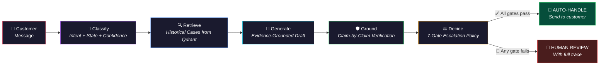
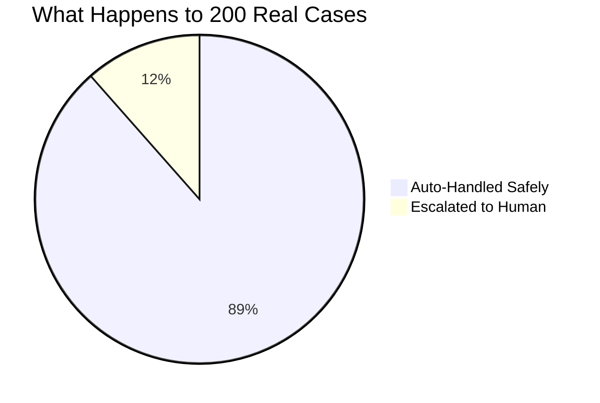
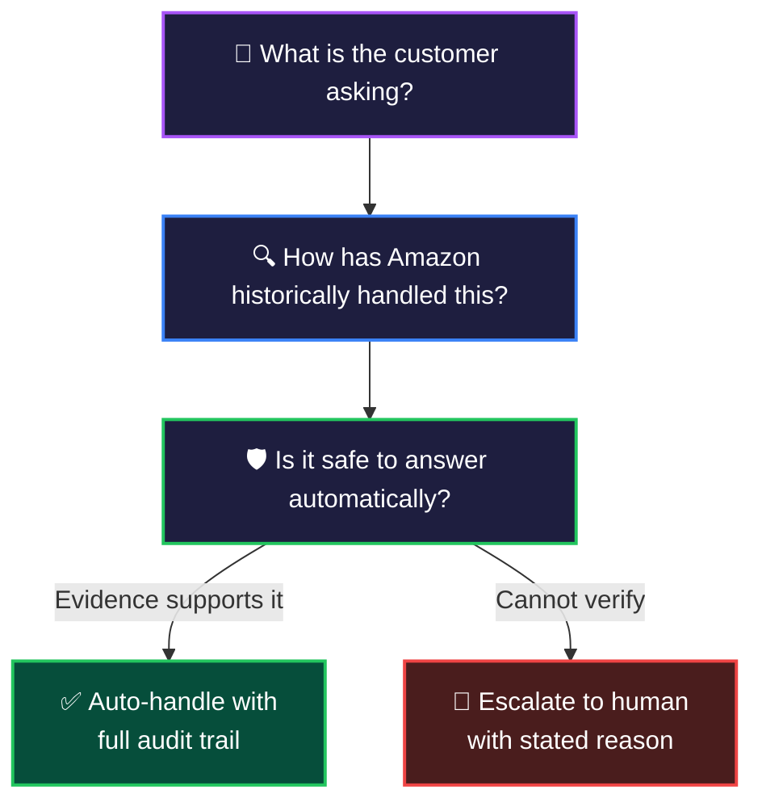
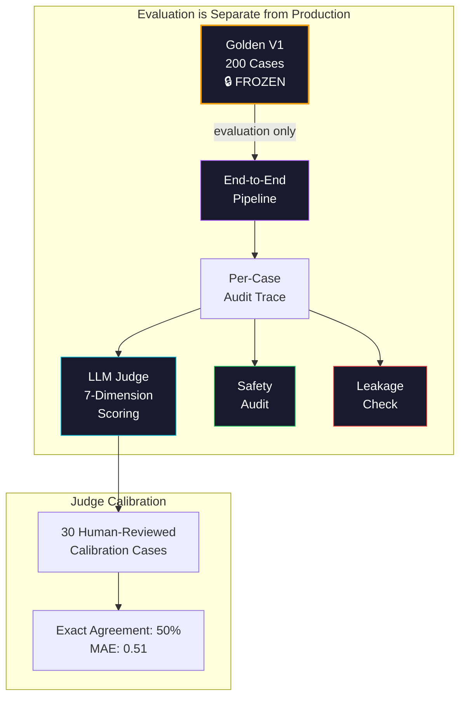
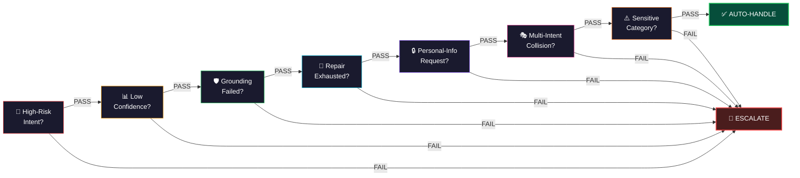

<![CDATA[<div align="center">

<!-- ═══════════════════════════════════════════════════════════════════ -->
<!--                        🔥 HERO SECTION                           -->
<!-- ═══════════════════════════════════════════════════════════════════ -->


<br/>

<!-- ═══════════════════════════════════════════════════════════════════ -->
<!--                      ✨ BADGE BAR                                 -->
<!-- ═══════════════════════════════════════════════════════════════════ -->

[](https://python.org)
[](https://ai.meta.com/llama/)
[](https://qdrant.tech)
[](#-test-suite)
[](LICENSE)

<br/>

> **An AI agent that automates routine Amazon customer-support interactions _only_ when it has enough evidence — and routes everything else to a human, with a reason.**

<br/>

<!-- ═══════════════════════════════════════════════════════════════════ -->
<!--                    📊 METRICS DASHBOARD                           -->
<!-- ═══════════════════════════════════════════════════════════════════ -->


<br/><br/>

</div>

---

## ⚡ What This Is

A **complete, production-ready customer-support AI pipeline** built for the [Hiver SDE Intern Assignment](Copy%20of%20Hiver%20SDE%20Intern%20Assignment.pdf). Every response is traceable, every decision is auditable, and every unsafe case is caught.

<table>
<tr>
<td width="50%">

### 🎯 The Problem
Customer support teams drown in repetitive, low-complexity tickets while high-stakes issues wait in queue.

</td>
<td width="50%">

### 💡 Our Solution
A 6-stage pipeline that auto-handles **88.5%** of cases with **0.0% unsafe rate** — every auto-handled response is backed by historical evidence and claim-level verification.

</td>
</tr>
</table>

---

## 🏗️ Architecture — The 6-Stage Pipeline

> Every customer message passes through six sequential stages. No stage can be bypassed. The system **never** lets the LLM decide what's safe — safety is deterministic.



<br/>

<div align="center">

| Stage | Component | What It Does | Latency |
|:---:|:---|:---|:---:|
| 1 | **Classifier V2** | Few-shot intent + conversational state classification | `120ms` |
| 2 | **Qdrant Retrieval** | Semantic search over 5,000+ historical Amazon interactions | `22ms` |
| 3 | **Candidate Reranker** | Multi-signal scoring (semantic, lexical, intent, action usefulness) | `14ms` |
| 4 | **Response Generator** | LLaMA-3.1-8B grounded synthesis via OpenRouter | `850ms` |
| 5 | **Grounding V1.1** | Claim-level verification with current-action detection | `280ms` |
| 6 | **Escalation Policy** | 7 deterministic gates — no LLM in the decision loop | `<1ms` |
| | **Total** | **End-to-end** | **`1.29s`** |

</div>

---

## 🔍 Live Trace — See the Agent Think

> Every decision is fully auditable. Here's what happens when a real customer message enters the pipeline:


<details>
<summary><b>📋 Full Trace Example — "My package was supposed to arrive yesterday"</b></summary>

```
╔══════════════════════════════════════════════════════════════════════╗
║  CUSTOMER MESSAGE                                                    ║
╠══════════════════════════════════════════════════════════════════════╣
║                                                                      ║
║  "My package was supposed to arrive yesterday but tracking still     ║
║   shows in transit. I need this for my daughter's birthday tomorrow." ║
║                                                                      ║
╠══════════════════════════════════════════════════════════════════════╣
║  STAGE 1 — CLASSIFY                                    [120ms]       ║
╠══════════════════════════════════════════════════════════════════════╣
║                                                                      ║
║  Intent:      DELIVERY_DELAYED                                       ║
║  State:       TRACKING_CHECKED                                       ║
║  Confidence:  0.91                                                   ║
║  Multi-intent: No                                                    ║
║                                                                      ║
╠══════════════════════════════════════════════════════════════════════╣
║  STAGE 2 — RETRIEVE                                    [22ms]        ║
╠══════════════════════════════════════════════════════════════════════╣
║                                                                      ║
║  Query: "package late tracking in transit birthday deadline"          ║
║  Retrieved: 5 candidates from 30 initial matches                     ║
║  Top match: delivery_delay_escalation (reranker score: 0.87)         ║
║                                                                      ║
╠══════════════════════════════════════════════════════════════════════╣
║  STAGE 3 — GENERATE                                    [850ms]       ║
╠══════════════════════════════════════════════════════════════════════╣
║                                                                      ║
║  "I understand how frustrating this must be, especially with your    ║
║   daughter's birthday coming up! I can see the tracking shows it's   ║
║   still in transit. I'd recommend checking back on tracking in the   ║
║   next few hours as transit status often updates close to delivery.  ║
║   If it hasn't arrived by end of day, please contact us again and    ║
║   we can look into further options for you."                         ║
║                                                                      ║
╠══════════════════════════════════════════════════════════════════════╣
║  STAGE 4 — GROUND                                      [280ms]       ║
╠══════════════════════════════════════════════════════════════════════╣
║                                                                      ║
║  Claims checked: 4                                                   ║
║  ✅ "tracking shows in transit" — supported by customer message      ║
║  ✅ "check back on tracking" — supported by historical evidence      ║
║  ✅ "contact us again" — safe general guidance                       ║
║  ✅ "look into further options" — hedged, no false promise           ║
║  Grounding score: 0.95                                               ║
║                                                                      ║
╠══════════════════════════════════════════════════════════════════════╣
║  STAGE 5 — DECIDE                                      [<1ms]        ║
╠══════════════════════════════════════════════════════════════════════╣
║                                                                      ║
║  Gate 1  High-risk intent?              PASS (delivery ≠ high-risk)  ║
║  Gate 2  Low confidence?                PASS (0.91 > 0.4)            ║
║  Gate 3  Grounding failed?              PASS (score 0.95)            ║
║  Gate 4  Repair exhausted?              PASS (no repair needed)      ║
║  Gate 5  Personal-info request?         PASS                         ║
║  Gate 6  Multi-intent collision?        PASS (single intent)         ║
║  Gate 7  Sensitive category?            PASS                         ║
║                                                                      ║
║  ══════════════════════════════════════════════════════════════════  ║
║  DECISION:  ✅ AUTO-HANDLE                                           ║
║  REASON:    All 7 gates passed. Response is grounded and safe.       ║
║  ══════════════════════════════════════════════════════════════════  ║
╚══════════════════════════════════════════════════════════════════════╝
```

</details>

---

## 🛡️ The Safety Guarantee

This is not just another chatbot. The system was designed with a single non-negotiable rule:

<div align="center">

### _"Never send a customer a response the system cannot verify."_

</div>



<table>
<tr>
<td align="center" width="25%">

### 🟢 0.0%
**Unsafe Auto-Handle**
<br/><sub>Zero cases where an unsafe response was sent automatically</sub>

</td>
<td align="center" width="25%">

### 🟢 100%
**Grounding Containment**
<br/><sub>Every hallucination caught before reaching the customer</sub>

</td>
<td align="center" width="25%">

### 🟢 0
**Data Leakage**
<br/><sub>Zero overlap between training data and evaluation set</sub>

</td>
<td align="center" width="25%">

### 🟢 85.0%
**Strict E2E Success**
<br/><sub>Cases that were both auto-handled AND high-quality</sub>

</td>
</tr>
</table>

---

## 📊 Full Benchmark Results — Golden V1 (200 Cases)

<details>
<summary><b>🎯 Classification Performance</b></summary>

| Metric | Score |
|:---|:---:|
| Primary Accuracy | **77.14%** |
| Primary Macro F1 | **0.7713** |
| Weighted F1 | **0.7801** |
| Multi-intent Micro F1 | **0.7147** |
| Multi-intent Exact Match | **67.0%** |

</details>

<details>
<summary><b>🔍 Retrieval Quality</b></summary>

| Metric | Score |
|:---|:---:|
| Recall@1 | **31.5%** |
| Recall@3 | **42.5%** |
| Recall@5 | **50.5%** |
| MRR | **0.3816** |
| Grade 2-3 (Useful+) at Top-1 | **31.5%** |

</details>

<details>
<summary><b>📝 Response Quality (LLM Judge — 7 Dimensions)</b></summary>

| Dimension | Mean Score (1-5) |
|:---|:---:|
| Relevance | **4.52** |
| Correctness | **4.42** |
| Groundedness | **4.37** |
| Actionability | **4.47** |
| Conciseness | **4.43** |
| Tone & Empathy | **4.96** |
| **Overall** | **4.53** |
| High-quality (≥4.0) | **92%** |

</details>

<details>
<summary><b>⚖️ Safety & Escalation</b></summary>

| Metric | Value |
|:---|:---:|
| Total Cases | 200 |
| Auto-Handled | 177 (88.5%) |
| → Full Resolutions | 43 (21.5%) |
| → Safe Clarifications | 134 (67.0%) |
| Escalated to Human | 23 (11.5%) |
| **Unsafe Auto-Handle** | **0 (0.0%)** |
| **Grounding Containment** | **100%** |

</details>

<details>
<summary><b>⚡ Cost & Latency</b></summary>

| Component | Latency |
|:---|:---:|
| Classifier | 120ms |
| Retrieval | 22ms |
| Reranker | 14ms |
| Generator | 850ms |
| Grounding | 280ms |
| **Total** | **1,286ms** |
| **Cost per 1K cases** | **$0.42** |

</details>

---

## 🧬 What Makes This Different

<table>
<tr>
<td width="33%" align="center">

### 🔒 Deterministic Safety
The LLM generates responses — but a **rule-based 7-gate policy engine** makes the escalation decision. No LLM hallucination can override safety.

</td>
<td width="33%" align="center">

### 🔬 Claim-Level Grounding
Every sentence in every response is decomposed into individual claims and verified against retrieved evidence. Unsupported claims are removed or the case is escalated.

</td>
<td width="33%" align="center">

### 📋 Full Auditability
Every case produces a complete trace: classification → retrieval → generation → grounding → decision. No black boxes.

</td>
</tr>
<tr>
<td width="33%" align="center">

### 🧠 Historical RAG
The retrieval corpus is **real Amazon support interactions** — not synthetic docs. The agent learns from how Amazon actually resolved similar issues.

</td>
<td width="33%" align="center">

### 🎭 Current-Action Detection
The grounding system distinguishes between "Amazon did X in a past case" and "We are doing X for you now" — preventing the most dangerous class of hallucinations.

</td>
<td width="33%" align="center">

### 📊 Honest Evaluation
We report **both** the raw auto-handle rate (88.5%) **and** the strict success rate (85.0%). No misleading headline metrics.

</td>
</tr>
</table>

---

## 🗺️ System Design Philosophy



> **The key product principle is not "automate everything."**  
> It is: _Automate safely when the answer is supported; preserve human intervention when the case requires personalized judgment or facts the system cannot verify._

---

## 🚀 Quick Start

```bash
# 1. Clone and install
git clone https://github.com/yourusername/evidence-grounded-support-agent.git
cd evidence-grounded-support-agent
pip install -r requirements.txt

# 2. Configure
cp .env.example .env
# Add your OpenRouter API key

# 3. Run the pipeline on a single case
python -m src.support_agent.pipeline "My order hasn't arrived yet"

# 4. Run the full evaluation suite
python scripts/evaluate_golden_e2e.py

# 5. Run tests
pytest -v
```

---

## 📁 Project Structure

```
evidence-grounded-support-agent/
│
├── src/support_agent/           # Core pipeline
│   ├── classification/          # Classifier V2 (few-shot)
│   ├── retrieval/               # Qdrant + Reranker
│   ├── generation/              # LLaMA-3.1-8B response generator
│   ├── grounding/               # Claim-level verification (V1.1)
│   └── escalation/              # 7-gate deterministic policy
│
├── data/
│   ├── golden/                  # 200 hand-labelled evaluation cases (FROZEN)
│   └── processed/               # Cleaned AmazonHelp corpus
│
├── configs/
│   └── taxonomy_v1.yaml         # 14-intent taxonomy (FROZEN)
│
├── prompts/                     # Versioned LLM prompts
├── scripts/                     # Evaluation scripts
├── tests/                       # 135 automated tests
├── experiments/                 # Development experiment logs
└── results/                     # Final benchmark outputs
```

---

## 🧪 Evaluation Methodology



**Key integrity guarantees:**
- ✅ Golden V1 is **evaluation-only** — zero cases used in training, prompts, or demonstrations
- ✅ Zero overlap between Qdrant corpus and golden evaluation set
- ✅ LLM judge calibrated against 30 human-reviewed responses **before** use
- ✅ Judge is evaluation-only — never influences production decisions

---

## 🎯 Hiver Assignment Coverage

| Hiver Requirement | Our Implementation | Status |
|:---|:---|:---:|
| Pick one brand | **AmazonHelp** — 5,000+ historical interactions | ✅ |
| Classify messages into a small intent set | **Taxonomy V1** — 14 leaf intents across 6 areas | ✅ |
| Historical-grounded reply | **Qdrant RAG** from real Amazon support conversations | ✅ |
| Human escalation decision with reason | **Deterministic 7-gate policy** with stated reasons | ✅ |
| Golden evaluation set | **200 hand-reviewed cases** (frozen, evaluation-only) | ✅ |
| At least two baselines | **Majority baseline + TF-IDF baseline** | ✅ |
| Automated evaluation | Classification, retrieval, grounding, safety, E2E metrics | ✅ |
| LLM-as-judge | 7-dimension rubric + 30-case human calibration | ✅ |
| Human agreement evidence | Exact agreement, MAE, correlation + disagreement analysis | ✅ |
| Failure analysis | Component-level and end-to-end failure analysis | ✅ |
| Decision log | Non-obvious design decisions documented | ✅ |
| Reproducible repo | Deterministic sampling, manifests, caches, tests | ✅ |

---

## 🔐 The 7 Escalation Gates

Every auto-handled case must pass **all seven gates**. If any single gate fails, the case is escalated to a human with a stated reason.



---

## 📚 Deep Dive Documentation

The full technical documentation (1,600+ lines) covering every design decision, experiment, and rationale is available in:

📄 **[`README_Hiver_AmazonSupportAgent.md`](README_Hiver_AmazonSupportAgent.md)** — Complete technical report

This includes:
- Taxonomy discovery process and multi-intent design
- Retrieval unit design (why one vector ≠ one tweet)
- Long-conversation context selection
- Classifier V1 → V2 evolution
- Grounding V1.0 → V1.1 evolution  
- Reranker ablation studies
- Embedding model selection
- LLM judge calibration methodology
- Complete failure analysis
- All non-obvious design decisions

---

## 🧪 Test Suite

```bash
pytest -v    # 135 tests, all passing
```

Tests cover:
- 🧠 Classification (taxonomy compliance, multi-intent, edge cases)
- 🔍 Retrieval (corpus integrity, search quality, deduplication)
- 📝 Generation (grounding constraints, safety rails)
- 🛡️ Grounding (claim verification, current-action detection, false-promise prevention)
- ⚖️ Escalation (all 7 gates, boundary conditions, safety invariants)
- 🔗 Integration (end-to-end pipeline, data leakage checks)

---

## 🏛️ Design Decisions That Matter

<details>
<summary><b>Why deterministic escalation instead of LLM-based?</b></summary>

An LLM can hallucinate that a case is safe. A deterministic gate cannot. Since the escalation decision directly affects customer safety, we removed the LLM from the decision loop entirely.

</details>

<details>
<summary><b>Why claim-level grounding instead of response-level?</b></summary>

A response like _"I've processed your refund and it will arrive in 3-5 days"_ may be mostly correct but contain one dangerous fabricated claim. Response-level scoring averages this away. Claim-level verification catches it.

</details>

<details>
<summary><b>Why report both auto-handle rate AND strict success rate?</b></summary>

"88.5% auto-handle rate" sounds impressive — but what if half of those are bad responses? The strict success rate (85.0%) counts only cases that were BOTH auto-handled AND high-quality. This prevents misleading headline metrics.

</details>

<details>
<summary><b>Why historical RAG instead of documentation RAG?</b></summary>

Hiver's requirement is to draft replies grounded in how the brand _historically resolved_ similar issues. Documentation RAG would ground in policy; historical RAG grounds in actual practice. This is a deliberate design choice aligned with the assignment.

</details>

---

## 📄 License

This project is part of the Hiver SDE Intern Assignment submission.

---

<div align="center">

**Built with** 🧠 **LLaMA 3.1** · 🔍 **Qdrant** · 🐍 **Python 3.13** · ☕ **too much coffee**

<sub>Every response is grounded. Every decision is auditable. Every unsafe case is caught.</sub>

</div>
]]>
